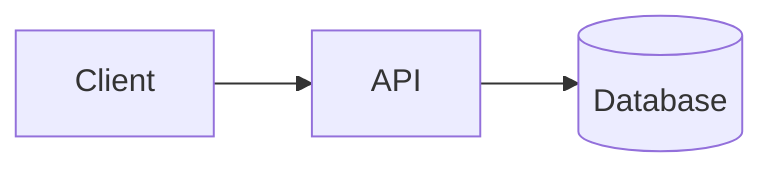

<!-- Source: ApexYard · templates/project-readme.md · github.com/me2resh/apexyard · MIT -->

<!--
  HOW TO USE THIS TEMPLATE

  A README exists to answer four questions, in this order:

    1. What is this?        → Title, Problem, Demo
    2. Does it work?        → Evaluation, Testing, Monitoring
    3. Can I run it?        → Quickstart, Configuration, Deployment
    4. How was it built?    → Architecture, Structure, Decisions, CI/CD

  Scale the sections to the project. A CLI utility does not need an
  evaluation section; a machine-learning service is not credible without
  one. DELETE sections that genuinely do not apply — but do NOT delete a
  section to hide a gap. If there are no automated tests, say so under
  Limitations. A missing section reads as "not applicable"; an honest
  sentence reads as a known gap. Those are very different claims.

  Two rails while filling this in:
    - Present tense describes only what SHIPS TODAY. Anything planned goes
      under Future Work, never in the feature list.
    - Every command must have been run, on a clean checkout, in the shape
      written here.

  Strip these HTML comments before publishing.
-->

# {Project Name}

<!-- Live links go here, immediately under the title — before any prose.
     A reader who only wants to see the thing working should not have to
     scroll. Delete the line if nothing is deployed. -->

**[Live demo]({url})** · **[API docs]({url})** · **[Dashboard]({url})**

{One or two sentences naming the user, the problem, and the solution. Do
not open with the tech stack — "Built with React, FastAPI and Postgres"
tells a reader nothing about whether this is for them.

Formula: "{Project} is a {system type} that helps {specific user} do {task}."}

---

## The Problem

<!-- Proportional to scope: two sentences for a small tool, a few
     paragraphs for something substantial. Answer four things. -->

- **What is the user trying to accomplish?** {goal}
- **What makes it difficult?** {friction, cost, or failure mode}
- **Why are existing solutions inadequate?** {gap in the alternatives}
- **Who has this problem?** {the specific audience, not "everyone"}

## Demo

<!-- Show it working WITHOUT requiring installation. In order of
     preference: live link → short video → GIF → screenshots → a worked
     input/output example in a fenced block.

     Lead with the CORE workflow, not an edge case. Keep a static asset
     (GIF/screenshot) alongside any live link — hosted demos disappear,
     and a dead link is worse than no link. -->


{One line naming what the reader is looking at.}

---

## Evaluation

<!-- For anything whose output quality is a question — ML, retrieval, AI
     features, ranking, parsers, anything heuristic. Without this a
     reader can see answers but cannot judge whether they are RELIABLE.
     Delete only if the project has no quality dimension to measure. -->

**Dataset.** {What it is, how big, and how it reflects real usage.}

**Baseline → final.** {What you started from, what you changed, what moved.}

| Approach | {Metric} | {Metric} |
|----------|----------|----------|
| Baseline — {what} | {value} | {value} |
| **Final — {what}** | **{value}** | **{value}** |

**Best configuration.** {The parameters that produced the final row.}

Full experiments and results: [{path/to/evaluation}]({path/to/evaluation})

## Testing

<!-- If there are no automated tests, write exactly that and move on.
     Do NOT delete this section — omission implies coverage that does
     not exist. -->

{What is covered — unit / integration / end-to-end — and what is not.}

Prerequisites: {database running, API keys set, fixtures loaded — state
these BEFORE the command, or the command fails for every new reader.}

```bash
{single command that runs the suite}
```

## Monitoring

<!-- Delete for projects with no runtime. -->

{What is captured, where it is stored, how to reach the dashboard, and —
the part usually missing — which signals you actually act on and what
they tell you when they move.}

---

## Quickstart

<!-- The shortest reliable path from a clean machine to a running app.
     "Reliable" is the load-bearing word: run these commands on a fresh
     clone before committing them. Untested setup instructions are the
     single most common reason a reader gives up. -->

**Prerequisites:** {language + version, package manager, Docker, system
libraries, accounts needed}

```bash
git clone {repo-url}
cd {project}

{install dependencies}
cp .env.example .env      # then fill in the values described below
{start required services}
{run the app}
```

{Where it is now running — e.g. "The app is at http://localhost:3000."}

<!-- Longer local-development notes and troubleshooting belong in their
     own sections or a linked doc — do not let them bury the happy path. -->

## Configuration

<!-- Every external input the project needs. A reader must be able to
     tell what is REQUIRED to boot from what is optional. -->

| Variable | Required | Purpose |
|----------|----------|---------|
| `{VAR}` | yes | {what it does, where to get it} |
| `{VAR}` | no | {what it enables; the default without it} |

{State plainly whether the app starts without the optional integrations —
monitoring, cloud accounts, third-party APIs. This is the question every
first-time reader has and it is almost never answered.}

**Data sources.** {Where the data comes from, which files it lands in,
and the command that ingests it.}

## Deployment

{Where it is hosted, which services it depends on, and how a deploy is
triggered — manually or through CI. Name the secrets and environment
variables the target environment needs, and say what someone else would
do to stand up their own copy.}

<!-- For multi-service setups, a small diagram here beats three
     paragraphs. If full instructions would swamp the README, keep the
     summary here and link the detail. -->

---

## Architecture

<!-- Show how a request and its data move through the system. Mermaid, an
     image, or a plain text flow — the format matters far less than
     whether a reader can follow it. -->



{A short paragraph under the diagram. A diagram shows what the pieces
are; it rarely explains WHY each one exists. That sentence is the part
readers actually need.}

## Project Structure

<!-- A simplified tree with one-line descriptions — not `tree` output.
     Show only the paths that help someone navigate. -->

```
{project}/
├── {src}/           # {what lives here}
│   ├── {api}/       # {what lives here}
│   └── {core}/      # {what lives here}
├── {tests}/         # {what lives here}
└── {notebooks}/     # {what lives here}
```

<!-- Notebooks get descriptive filenames — `retrieval-evaluation.ipynb`,
     not `notebook1.ipynb` or `final_v2.ipynb`. Say which one produced
     the numbers reported above. -->

## Decisions and Trade-offs

<!-- The consequential choices only: model, framework, datastore,
     retrieval strategy, hosting. Not every import.

     The technology matters less than the reasoning. A reader who
     disagrees with the choice should still be able to see that it was
     a choice. -->

**{Decision}.** Chose {X} over {Y} because of {constraint}. The cost is
{downside}, accepted because {reason}.

**{Decision}.** {Same shape.}

## CI/CD

<!-- If there is no pipeline, note it under Limitations rather than
     leaving an empty heading here. -->

{What triggers a run, which checks execute, what happens when one fails,
and whether a green run deploys automatically.}

---

## Limitations

<!-- Specific and unapologetic. "May have some limitations" tells a
     reader nothing; a named boundary with its practical consequence
     tells them everything.

     Good: "The knowledge base holds 207 exercises. It covers common
     strength movements but omits most mobility work, so those queries
     return nothing."
     Bad: "The dataset could be more comprehensive." -->

- {Boundary, and what it means in practice for a user.}
- {Boundary, and what it means in practice for a user.}

## Future Work

<!-- Prioritised and concrete, following from the limitations above.
     This is the ONLY place unbuilt things may appear. -->

- {What would change, and why it matters.}

## License

{License} — see [LICENSE](LICENSE).
